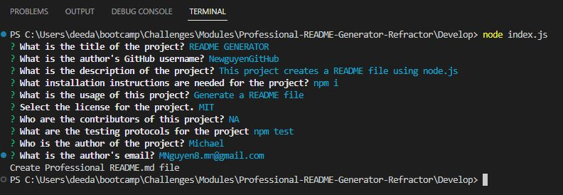
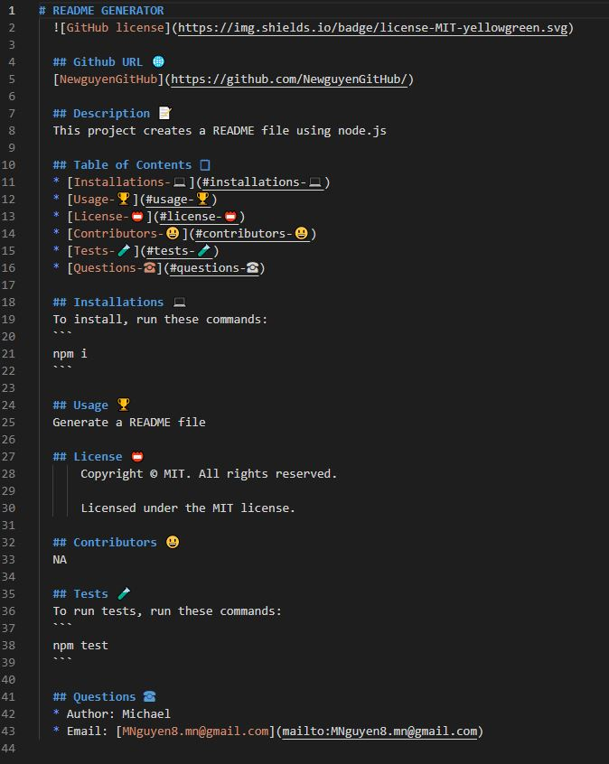
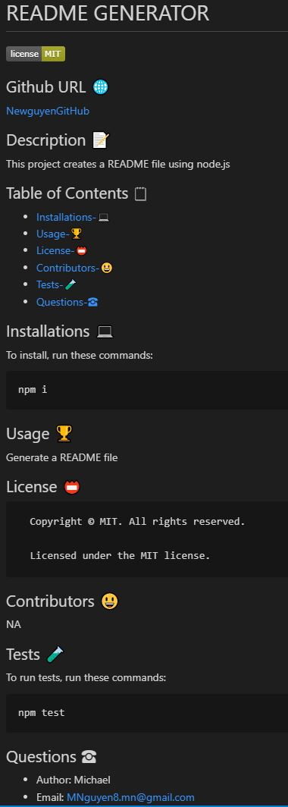

# Professional-README-Generator-Refractor

## URL
N/A

## Description

This project is a README generator that creates a README file for the user based on inputs.
Using node, the user gets prompts asking about the README.
The user's input will then create a README file.

## Summary

```
GIVEN a command-line application that accepts user input
WHEN I am prompted for information about my application repository
THEN a high-quality, professional README.md is generated with the title of my project and sections entitled Description, Table of Contents, Installation, Usage, License, Contributing, Tests, and Questions
WHEN I enter my project title
THEN this is displayed as the title of the README
WHEN I enter a description, installation instructions, usage information, contribution guidelines, and test instructions
THEN this information is added to the sections of the README entitled Description, Installation, Usage, Contributing, and Tests
WHEN I choose a license for my application from a list of options
THEN a badge for that license is added near the top of the README and a notice is added to the section of the README entitled License that explains which license the application is covered under
WHEN I enter my GitHub username
THEN this is added to the section of the README entitled Questions, with a link to my GitHub profile
WHEN I enter my email address
THEN this is added to the section of the README entitled Questions, with instructions on how to reach me with additional questions
WHEN I click on the links in the Table of Contents
THEN I am taken to the corresponding section of the README
```

## Installation

npm i
node index.js

## Usage

This is a node.js file that creates a README file for the user based on the user input.



https://user-images.githubusercontent.com/118239578/219817208-510538be-c49a-4dcb-a258-56d43c496d06.mp4


## Credits

N/A

## License

Please refer to the LICENSE in the repo.
